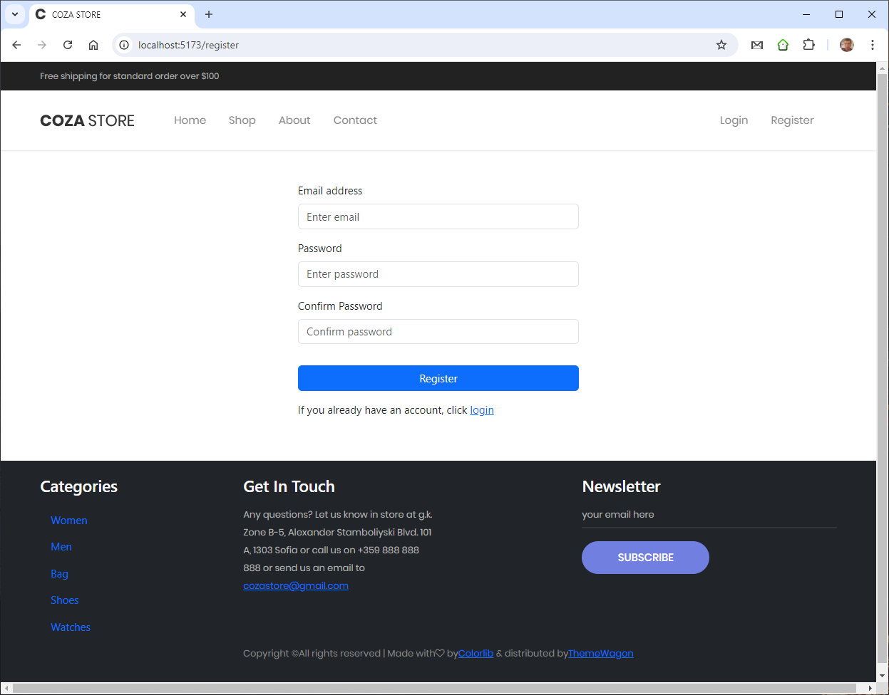

# Cozastore

This is a e-commerce frontend application, created using ReactJS.

| Contents
|---
| [Demo](#demo)
| [Running the Application with Docker](#running-the-application-with-docker)
| [Getting Started](#getting-started)
| [Authentication](#authentication)
| [What it does:](#what-it-does)
| - [Guests](#guest-visitors-can)
| - [Members](#logged-members-can-also)

## Demo

Demonstration of app can be see on: https://cozastore-client.onrender.com

## Running the Application with Docker

This project includes a `docker-compose.yml` file to simplify the process of setting up and running the application using Docker.

#### Prerequisites

- [Docker](https://www.docker.com/get-started) installed on your local machine.
- [Docker Compose](https://docs.docker.com/compose/install/) installed (usually included with Docker Desktop).

#### 1. Clone the repository:

```
git clone https://github.com/rostislav-ivanov/cozastore-client
cd cozastore-client

```

#### or alternatively, you can download the `docker-compose.yml` file:

```
curl -O https://raw.githubusercontent.com/rostislav-ivanov/cozastore-client/main/Docker-compose.yaml

```

#### 2. Start the application:

```
docker-compose up -d

```

#### 3. Access the application:

- Frontend: Visit `http://localhost:8080` to access the frontend application.
- Backend: The backend API will be available at `http://localhost:3030`.

#### 4. Stop the application and remove containers:

```
docker-compose down

```

#### 5. Stop the application and remove containers and images:

```
docker-compose down --rmi all

```

## Getting Started

#### Prerequisites

- [Node.js](https://nodejs.org/en): A JavaScript runtime for building and running the application.

#### 1. To start the server, run the following commands in the terminal:

```
git clone https://github.com/rostislav-ivanov/cozastore-server
cd cozastore-server
node server.js

```

#### 2. To start the client, run the following commands in new terminal:

```
git clone https://github.com/rostislav-ivanov/cozastore-client
cd cozastore-client
npm install
npm run dev

```

#### 3. Access the application:

- Frontend: Visit `http://localhost:5173` to access the frontend application.
- Backend: The backend API will be available at `http://localhost:3030`.

## Authentication

The service is initialized with three users, which can be used for immediate testing:

- peter@abv.bg : 123456
- george@abv.bg : 123456
- admin@abv.bg : admin

The user peter@abv.bg has seed data

## What it does:

The website provides informative and functional webpages for browsing products and navigating through user friendly shopping.The website can be used as a guest visitor and member.


- ### Guest visitors can:
  - [x] see all products in shop
        
  - [x] quick view of selectid product contain information about size ,color and price
        
  - [x] see details of selected product with size, color, price, description and matirial
  - [x] see about page
  - [x] see contact page and send an email to site
        
  - [x] subscribe to newsletter
        
  - [x] register and login
        
        
- ### Logged members can also:
  
  - [x] add product to cart
        
  - [x] see the products in bag
        
  - [x] checkout
        
    - [x] edit quantity of each product
    - [x] remove product from cart
    - [x] select shipping address
  - [x] add / remove wish
  - [x] see the wishes product
  - [x] manage their account details:
    - [x] profile - edit shipping information
          
    - [x] orders with their status
          
    - [x] wish list
          
    - [x] logout
